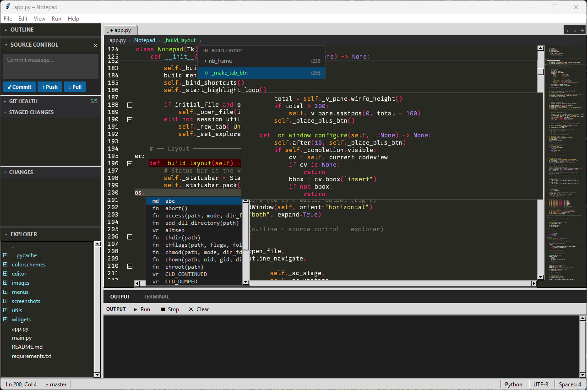
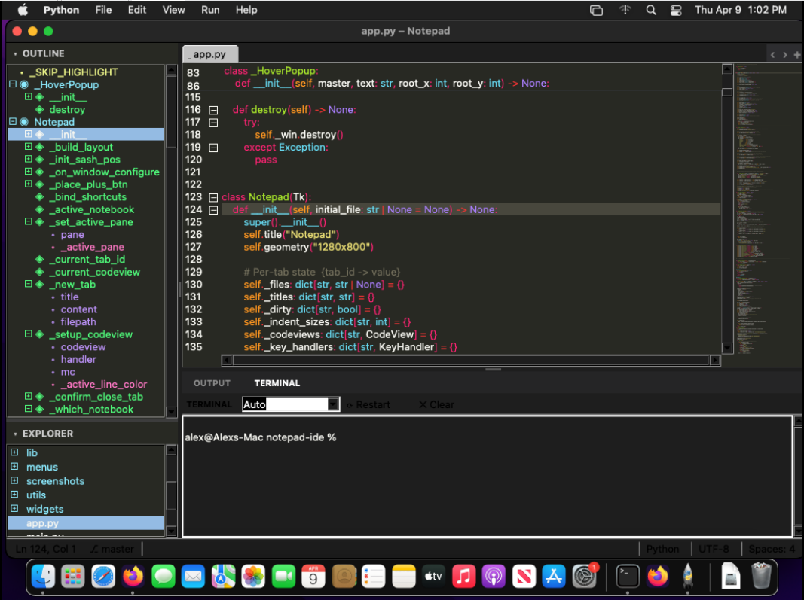
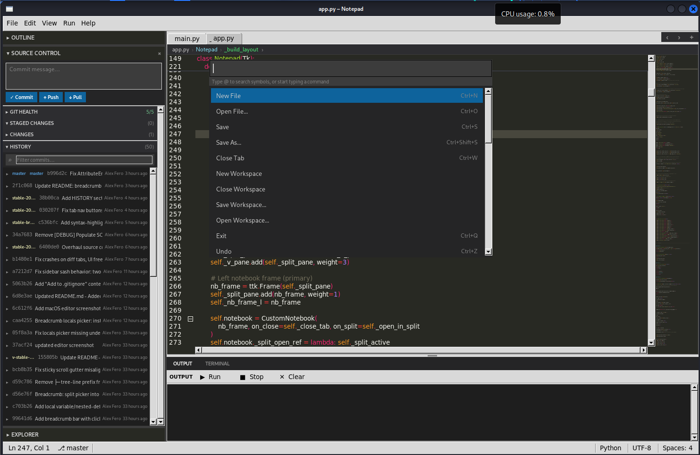
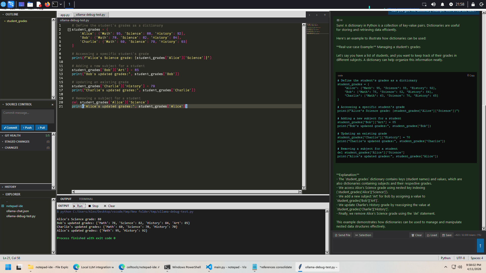

# IDOL
### Integrated Development and Objective Learning
**created by [gitPIDE](https://github.com/celltoolz/notepad-ide)** — GitHub's Python IDE

<p align="center">
  
</p>

IDOL is what IDLE should have been — a full Python IDE with professional-grade tools (LSP, git, terminal, split editor) and a built-in learning platform designed to grow with you. Beginner-friendly without being beginner-limited. Pure Python, no Electron, no dependencies beyond pip.

Runs natively on **Windows**, **macOS**, and **Linux** from a single codebase.


<br>



## Features

### Editor
- Multi-tab editor with drag reorder, hover close button, and right-click tab menu
- Syntax highlighting via [Pygments](https://pygments.org/) with multiple color schemes (Dracula, Monokai, Ayu, Material, and more)
- Line numbers with code folding (click ⊟/⊞ markers to collapse/expand blocks)
- Sticky scroll — enclosing scope pins to the top while you scroll, fully syntax highlighted with correct line numbers
- Minimap — live scaled-down view with hover zoom preview and mouse wheel scrolling
- Multi-cursor editing — Alt+Click to place additional cursors; all cursors edit in sync
- Insert key mode — toggles overwrite mode with block cursor and OVR status bar indicator
- Bracket matching, auto-indent, auto-close pairs, wrap selection in brackets/quotes

### Breadcrumb Bar
- Thin bar between the tab row and editor showing the full file path and current symbol scope
- Path crumbs — each folder segment is clickable to set it as the explorer root
- Symbol crumbs — updates live as the cursor moves; shows class › method hierarchy in the active file's color scheme
- **Sibling picker** — click any symbol crumb to see all peer symbols at that scope level and jump to one
- **Locals drill-down** — a `›` appears after the innermost crumb when locals exist; clicking it opens a picker showing all local variables, loop targets, and nested definitions inside that function
- **Syntax-highlighted footer** — hover any local to see its source line rendered with the active theme's token colors
- **Marquee scroll** — when the source preview overflows the footer width it smoothly ping-pongs left and right so the full line is always readable
- Keyboard navigation (↑↓ Enter Escape) in both pickers; scrollable for large symbol lists

### Intelligence (LSP)
- Diagnostics — error and warning squiggles powered by [pylsp](https://github.com/python-lsp/python-lsp-server)
- Hover documentation — rest the mouse over any symbol for inline docs
- Go to Definition — F12 or right-click menu
- Autocomplete — dropdown with kind labels, keyboard navigation (↑↓ to move, Tab/Enter to accept, Escape to dismiss)

### Navigation & Search
- Command palette — Ctrl+Shift+P; fuzzy search all commands, type @ to search symbols by name
- AST-based Outline panel — classes, functions, methods, parameters, instance attributes, local variables, and nested definitions; all shown in a collapsible tree
- File Explorer with lazy loading, directory navigation, and drag-to-resize sash
  - Right-click menu: New File, New Folder, Rename, Delete, Set as Root Directory, Add to .gitignore
  - Drag and drop files between folders with unsaved-changes prompt
- Find References panel — right-click any symbol to see all occurrences
- VS Code-style inline Find & Replace bar (case, whole word, and regex toggles)

### Split Editor
- Side-by-side editing — drag a tab past the midpoint or use Ctrl+\\ / right-click menu
- Scroll lock — ⇕ button syncs both panes to the same scroll position; keyboard Scroll Lock key toggles it
- Unsaved changes check when closing the split pane

### Git Integration
- Branch name in status bar with live 30s polling
- M/A/U/D badges on tabs and file explorer entries
- Gutter diff strips showing added/modified/deleted lines
- Source Control panel — staged/unstaged file lists, stage/unstage/discard, commit, push/pull
- Diff view with color-coded +/- lines
- Smart warning detection — automatically identifies venv files, secrets, build artifacts, and OS metadata in untracked files
- Git Health panel — scannable checklist (`.gitignore` exists, no venv tracked, no secrets staged) with one-click fixes
- Inline file explanations — hover any file in the Source Control list for a tooltip explaining what it is and why git cares
- Guided Fix Wizard — step-by-step: what happened → why it matters → how to fix it, with an action button
- **Commit History panel** — scrollable HISTORY section inside Source Control showing the last 50 commits with colored ref/branch badges, author, and relative timestamps
  - Click any commit to expand an inline list of changed files
  - Click a file to open a syntax-highlighted diff tab scoped to that commit
  - Hover a commit row for a popup showing the full hash, author, absolute date, subject, and all refs
  - Filter bar to search commits by message, author, short hash, or branch name
  - "Load 50 more" button for repos with deep history

### Terminal & Output
- Integrated terminal — full VT100 PTY shell (PowerShell/bash/zsh) with accurate ANSI color rendering via [pyte](https://github.com/selectel/pyte), direct keyboard input, and scrollback history
- Mouse wheel scrolling — passes SGR scroll sequences to TUI apps (vim, htop) when mouse mode is active, otherwise scrolls the history buffer
- **Text selection** — click and drag to select; **Copy** via right-click or Ctrl+Shift+C; **Paste** via right-click or Ctrl+Shift+V
- **Virtual environment detection** — toolbar shows the active venv name and a Deactivate button when a venv is active; shows Activate when a `.venv` exists in the current directory; Switch button when a different venv is active
- Run / Output panel with stdout/stderr coloring
- **Run Line** — right-click any line to execute it instantly in the output panel
- **Run Selection** — right-click a highlighted block to run just that snippet (auto-dedents indented blocks)
- OUTPUT and TERMINAL tabs share the bottom panel

### AI Chat (F2)
- Press **F2** (or **Help → Ask AI**) to toggle a persistent right-side chat panel — stays open alongside your code
- Draggable sash lets you size the panel; width and visibility are saved across sessions
- Conversational interface to a local Ollama LLM — fully offline, no API key needed
- **📄 Send File** — attaches your currently open file as context for the next question
- **✂ Selection** — attaches highlighted code from the editor
- Streaming responses appear word-by-word in real time
- Code blocks are syntax-highlighted with a **⎘ Copy** button that strips the language hint automatically
- **💾 Save / 📂 Load** — export and reload full conversation history as JSON
- **🗑 Clear** — wipes conversation history from the UI, memory, and disk in one click
- Conversation auto-saves on exit and restores the last 20 messages on next launch
- Live token counter shows approximate context usage (e.g. `~1,200 / 32,000 tokens`) — turns amber near the limit
- **⚙** — toggles a URL field to point IDOL at a different Ollama host (e.g. a remote machine on your network); hit **Apply** to connect and verify instantly
- Same offline install card as Learning Mode when Ollama isn't running

### Package Manager (F3)
- Press **F3** (or **Help → Package Manager**) to open the package manager panel
- All installed packages are shown **grouped by topic** instantly — no network needed, powered by a precomputed 362K-package lookup covering 46% of PyPI
- **Live filter** — type in the search bar to instantly filter installed packages by name or topic category (e.g. type "web" to see all networking packages)
- **PyPI search** — press Enter or click **PyPI ↗** to search for new packages by name or keyword; results are ranked by relevance with well-known packages promoted to the top
- Click any package (installed or from PyPI search) to see its details: version, author, license, and description fetched from PyPI
- **⬇ Install** and **✕ Uninstall** buttons run pip in the background with live output streamed to the Output panel
- **✦ Ask AI for examples** — sends the selected package to the AI chat with a prompt for beginner-friendly code examples

### Learning Mode (F1)
- Press **F1** (or **Help → Learning Mode**) to open a dedicated Learning tab in the editor
- Hover over any IDE element — panels, buttons, the editor, status bar, breadcrumb — and the Learning tab populates instantly with:
  - **What it is** — plain-English description
  - **How it works** — the mechanics behind it
  - **Real-world example** — how you'd actually use it
- Zero overhead when the tab is closed — hover bindings are no-ops until F1 is active
- Covers 20+ IDE elements: editor, tabs, outline, references, source control, explorer, commit/push/pull/stage/discard, git health, commit history, status bar segments, breadcrumb bar, find & replace, output, terminal
- **✦ Local AI explanations** — powered by [Ollama](https://ollama.com) (no API key, runs fully offline)
  - Each hovered element gets an **Ask AI** button that streams a beginner-friendly explanation in real time
  - Offline card shows platform-specific install instructions and model setup when Ollama isn't running
  - Recommended model: `qwen2.5-coder` (~4GB) — install with `ollama pull qwen2.5-coder`

### Project Wizard
- **File → New Project…** launches a guided 4-step project setup wizard
  - Step 1: Project name and location (with live path preview)
  - Step 2: Python interpreter selection (auto-detects all installed versions, with venv/system filters) + virtual environment creation
  - Step 3: Optional git init and starter files (main.py, requirements.txt, .gitignore)
  - Step 4: Summary — review settings before creating
- Animated progress bar during venv creation so the UI stays responsive
- Integrated learning guides — paginated, scrollable guides with plain-English analogies covering:
  - Virtual environments: what they are, why to use them, choosing an interpreter, creating/activating, best practices
  - Git remotes: repositories, remotes, creating a repo on GitHub, connecting and pushing, authentication

### Workspace
- Session persistence — restores open tabs, layout, and explorer root on relaunch
- Save / Open Workspace for named sessions
- Status bar: line/column, cursor count, lexer name, indent cycle (spaces ↔ tabs)
- Zen mode — F10 hides the sidebar, output panel, and status bar for distraction-free editing; toast notification on entry
- **Toggle Sidebar** — Ctrl+B (or View → Show Sidebar) hides/shows the entire left panel in one click

### Nav Toolbar
- Thin toolbar strip pinned above the editor — always visible, zero clutter
- **‹ ›** — navigate backward/forward through edit history
- **+** — open a new tab
- **>_** — open a new terminal
- **SPLIT** — toggle split editor; highlights blue when active
- **MAP** — toggle minimap; highlights blue when active
- **☰** — toggle sidebar (Ctrl+B); highlights blue when active
- **ZEN** — toggle zen mode (F10); highlights blue when active
- **AI** — toggle AI Chat panel (F2); highlights blue when active
- **📦** — toggle Package Manager (F3); highlights blue when active
- **📖** — toggle Learning Mode (F1); highlights blue when active

## Requirements

```
pip install -r requirements.txt
```

For LSP features (diagnostics, hover, go-to-definition, autocomplete):
```
pip install python-lsp-server pyflakes
```

## Usage

```
python main.py
```

## Keyboard Shortcuts

| Action | Shortcut |
|---|---|
| New tab | Ctrl+N |
| Open file | Ctrl+O |
| Save | Ctrl+S |
| Save As | Ctrl+Shift+S |
| Close tab | Ctrl+W |
| Find & Replace | Ctrl+F |
| Command palette | Ctrl+Shift+P |
| Run file | F5 |
| Go to Definition | F12 |
| Split editor | Ctrl+\\ |
| Source control | Ctrl+Shift+G |
| New terminal | Ctrl+` |
| Terminal copy | Ctrl+Shift+C |
| Terminal paste | Ctrl+Shift+V |
| Learning Mode | F1 |
| AI Chat | F2 |
| Package Manager | F3 |
| Toggle sidebar | Ctrl+B |
| Zen mode | F10 |
| Change font | Ctrl+L |
| Add cursor | Alt+Click |
| Clear cursors | Escape / Click |
| Toggle overwrite | Insert |
| Run line / selection | Right-click menu |
| Toggle scroll sync | Scroll Lock |
