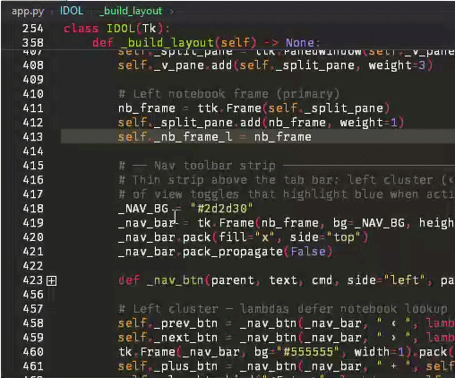
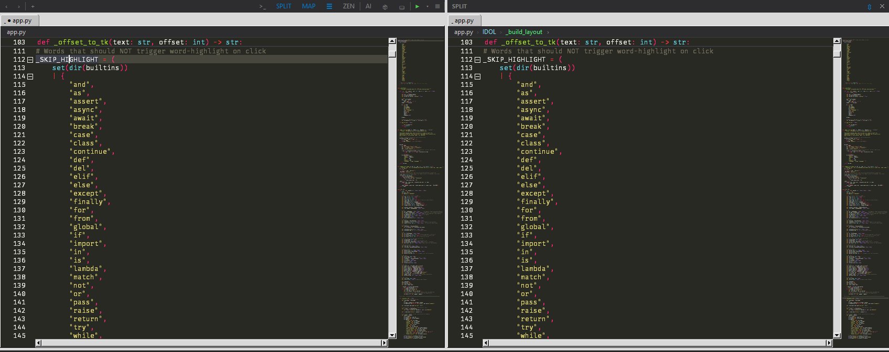
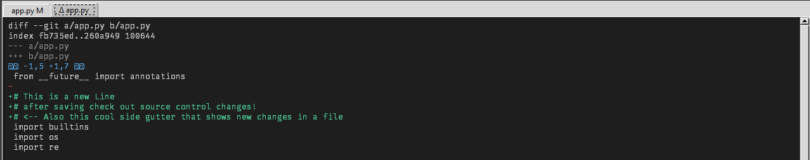
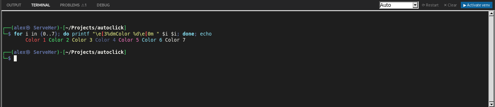
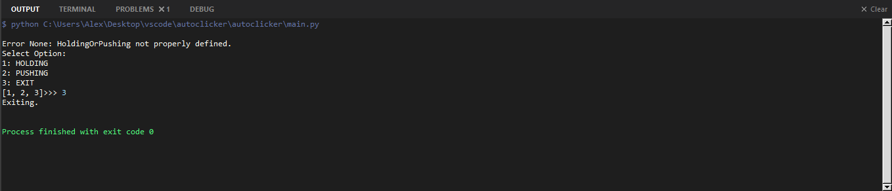
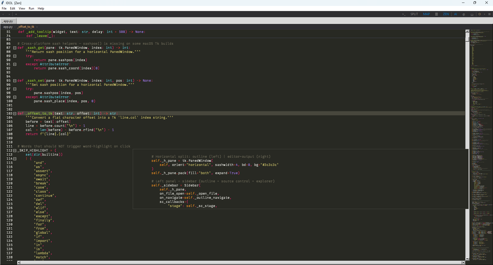
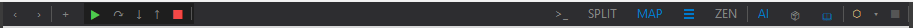
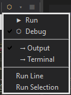

# IDOL
### Integrated Development and Objective Learning

<p align="center">
  
</p>

<p align="center">
  
  
  
  
  
  
  
  
</p>

IDOL is what IDLE could have been — a full Python IDE with professional-grade tools (LSP, git, terminal, split editor) and a built-in learning platform designed to grow with you. Beginner-friendly without being beginner-limited. Pure Python, no Electron, no dependencies beyond pip.

Runs natively on **Windows**, **macOS**, and **Linux** from a single codebase.
**Designer** still needs to undergo proper macOS/Linux debugging. Should have it up within the week (todays date: 5/2/26)

<p align="center">
  
</p>


## Features

### GUI Designer


<p align="center">
  
  
</p>

IDOL includes a full **VB6-style drag-and-drop GUI builder** for Tkinter applications — the only Python IDE with a visual form designer built in.

> **Getting started:** The Designer activates automatically for **Tkinter GUI App** projects. To create one, use [**File → New Project…**](#project-wizard) and select **Tkinter GUI App** as the project type — the wizard scaffolds the starter files and drops you straight into the canvas.

- **Visual canvas** — a dotted-grid design surface showing your form at real size with a simulated title bar and drop shadow; widgets render with realistic visuals (raised buttons, sunken entries, filled progress bars, checked checkboxes, and more)
- **Widget palette** — 14 widget types in a scrollable toolbox with canvas-drawn mini-previews: Button, Label, Entry, Text, Checkbutton, Radiobutton, Combobox, Listbox, Frame, LabelFrame, Scale, Spinbox, Progressbar, Separator
- **Drag, move & resize** — click to select any widget (blue dashed border + 8 white handles); drag to reposition; drag any handle to resize — all snapped to an 8px grid
- **Multi-select** — rubber-band drag to select multiple widgets; Ctrl+Click to toggle; drag the group to move all at once
- **Copy / Paste** — Ctrl+C / Ctrl+V to duplicate widgets; right-click context menu with Copy, Paste, Delete, Bring to Front, Send to Back
- **Properties panel** — right-side panel with a control selector dropdown at the top; Property and Value columns below; click any value to edit inline; geometry (x, y, width, height) updates live as you drag
  - **Color picker** — Background and Foreground properties open `tkinter.colorchooser`; the row tints immediately and the canvas widget updates live; new widgets get sensible default colors automatically
  - **State** — Button, Entry, Text, Combobox, and other widgets expose a `state` dropdown (normal / readonly / disabled); selecting readonly or disabled reveals conditional color rows (`readonlybackground`, `disabledbackground`, `disabledforeground`) that auto-fill with defaults and are hidden when not applicable
  - **Validation** — Entry and Spinbox expose a `validate` dropdown (key / focus / all / etc.) with `--vcmd`, `--args`, and `--ivcmd` sub-rows; `--args` has a preset dropdown for common tkinter substitution codes (`%P`, `%P, %S`, etc.); codegen emits `self.register(self.method)` wiring automatically
  - **Variable binding** — supported widgets expose a Variable section: set a name, type (StringVar / IntVar / DoubleVar / BooleanVar), and initial value; codegen emits the declaration and wires `textvariable=` / `variable=` automatically; click the variable name field to open a **variable picker popup** listing every variable defined on the form (from widget bindings and menu check/radio items) with its type — live-filters as you type, or type a new name manually
  - **Form properties** — click the canvas background to inspect the form: title, size, background color, border style (Sizable / Fixed / None), and maximize box; border style and maximize stay in sync automatically
  - **Menu bar** — a `menu bar` row opens the **Menu Editor**: a VB6-style dialog with Caption, Name, Shortcut, Enabled, Visible, **Type** (Command / Checkbutton / Radiobutton), **Variable** (with variable picker popup), **Command**, and **Value** fields; ← → ↑ ↓ arrow buttons to indent (make submenus) and reorder; an indented preview listbox; and a hover hint bar at the bottom describing each field; the menu bar renders live on the canvas below the title bar; **adding or removing a menu bar automatically shifts all widgets and resizes the form by 20 px**; codegen emits the full `tk.Menu` hierarchy — `add_checkbutton`/`add_radiobutton` for check/radio items with `variable=`, `value=`, and `command=` kwargs; declares `BooleanVar`/`StringVar` for menu variables; auto-stubs all leaf command handlers and check/radio command handlers; emits `self.bind("<shortcut>", handler)` for every item that has both a shortcut and a handler
  - **Hover interactions** — mousing over any row highlights it in blue; color props and optional props (font, relief, borderwidth, etc.) show a `×` button on the right to clear the value back to default; a short description of each property appears in the status bar at the bottom of the panel as you hover
- **Events tab** — every widget exposes its full event list (click, dblclick, keypress, focusin, change, and more); click an event name to auto-wire a default handler; type a custom method name to override
  - Handler names that don't start with `_` are flagged in red — non-underscore names go to the Functions section instead of the Events stub section
  - Hovering any event row — wired or empty — highlights it and shows the tkinter binding description in the status bar; wired rows show a `×` button to clear the handler
  - **? Events** row at the bottom opens a paginated guide explaining events, wiring steps, naming conventions, and a full reference table for the selected widget type
- **Click to navigate** — double-clicking a widget with events auto-generates code (if the form has ungenerated changes) then switches to Editor mode and places the cursor on the first event handler; double-clicking a widget with no events switches to the Events tab; clicking a menu item on the canvas dropdown navigates to its `_click` handler the same way
- **Code generation** — `Designer → Generate Code` (Ctrl+Shift+G) writes clean, class-based Python from the canvas model:
  ```python
  import tkinter as tk
  # ── IDOL:IMPORTS:BEGIN ── (add your imports between the markers)
  # Add your imports here
  # ── IDOL:IMPORTS:END ──

  class Form1(tk.Tk):
      def __init__(self):
          # ── IDOL:BEGIN ────── (generated — do not edit inside markers)
          super().__init__()
          self.title("My App")
          self.geometry("800x600")
          self.result_var = tk.StringVar()
          # ── IDOL:END ──────

          # Your __init__ code here is preserved across regeneration

          # ── IDOL:BEGIN ──────
          self._build_ui()
          # ── IDOL:END ──────

      def _build_ui(self):
          self.btn1 = tk.Button(self, text="Click Me", command=self._btn1_click)
          self.btn1.place(x=10, y=10, width=100, height=30)

      # ── Events ───────────────────────────────────────────────────────────────

      def _btn1_click(self, *args):
          pass  # TODO

      # ── Functions ────────────────────────────────────────────────────────────
      # Methods defined here are preserved across code generation.
  ```
- **Full user code preservation** — regenerating code never discards what you wrote:
  - Event handler **bodies** are extracted and spliced back in verbatim
  - Event handler **signatures** are preserved — change `*args` to `event: tk.Event` once and IDOL keeps it on every subsequent regeneration
  - User **imports** between the `IDOL:IMPORTS:BEGIN/END` markers survive regeneration
  - Helper methods in the `# ── Functions ──` section survive verbatim
  - Code in the two `__init__` user zones (between the IDOL marker blocks) is preserved
- **Manual edits detection** — if you edit the generated `.py` by hand, IDOL detects the change via SHA-256 checksum when you click Generate Code and warns you; event handlers, helpers, and `__init__` code are always preserved regardless
- **Run / navigate prompt** — clicking ▶ Run or double-clicking a widget while the designer has ungenerated changes silently auto-generates before proceeding
- **[Editor] | [Designer] mode bar** — a toggle strip above the editor switches the main area between code and canvas; the left panel swaps from File Explorer to the Widget Palette automatically
- **Project type gating** — the Designer only appears for **Tkinter GUI App** projects; Command Line projects see only the standard editor with no extra UI
- **Persistent form model** — the canvas state is stored in a `.form.json` sidecar file next to the generated `.py`; fully version-control friendly

### Editor


- Multi-tab editor with drag reorder, hover close button, and right-click tab menu; hover any tab to see its full file path as a tooltip
- Syntax highlighting via [Pygments](https://pygments.org/) with multiple color schemes (Dracula, Monokai, Ayu, Material, and more)
- Line numbers with code folding (click ⊟/⊞ markers to collapse/expand blocks)
- Sticky scroll — enclosing scope pins to the top while you scroll, fully syntax highlighted with correct line numbers
- Minimap — live scaled-down view with hover zoom preview and mouse wheel scrolling
- Multi-cursor editing — Alt+Click to add a cursor; Alt+Click an existing cursor to remove it; all cursors type, delete, and navigate in sync
  - Shift+Arrow extends an independent selection at each cursor; Ctrl+C copies all selections at once
  - Smart pairs (brackets, quotes) auto-close and skip-over correctly at every cursor
- Line move & duplicate — Alt+Up/Down moves the current line (or selected block) up or down; Shift+Alt+Down duplicates below (cursor follows); Shift+Alt+Up duplicates below (cursor stays on original)
- Insert key mode — toggles overwrite mode with block cursor and OVR status bar indicator
- Bracket matching, auto-indent, auto-close pairs, wrap selection in brackets/quotes

### Breadcrumb Bar

<p align="center">
  
</p>

- Thin bar between the tab row and editor showing the full file path and current symbol scope
- Path crumbs — each folder segment is clickable to set it as the explorer root
- Symbol crumbs — updates live as the cursor moves; shows class › method hierarchy in the active file's color scheme
- **Sibling picker** — click any symbol crumb to see all peer symbols at that scope level and jump to one
- **Locals drill-down** — a `›` appears after the innermost crumb when locals exist; clicking it opens a picker showing all local variables, loop targets, and nested definitions inside that function
- **Syntax-highlighted footer** — hover any local to see its source line rendered with the active theme's token colors
- **Marquee scroll** — when the source preview overflows the footer width it smoothly ping-pongs left and right so the full line is always readable
- Keyboard navigation (↑↓ Enter Escape) in both pickers; scrollable for large symbol lists

### Intelligence (LSP)


- **Multi-error diagnostics** — [ruff](https://github.com/astral-sh/ruff) runs on every keystroke (debounced) reading from stdin so unsaved buffers work; falls back to `compile()` for syntax errors when ruff isn't available
- **Three-tier severity** — red squiggles for crashes (syntax errors, undefined names), yellow for likely bugs, blue for style/unused imports
- **Cascade suppression** — diagnostics within 3 lines of a root syntax error are hidden so one bad line doesn't flood the list
- Hover documentation — rest the mouse over any symbol for inline docs (powered by [pylsp](https://github.com/python-lsp/python-lsp-server))
- Go to Definition — F12 or right-click menu
- Autocomplete — dropdown with kind labels, keyboard navigation (↑↓ to move, Tab/Enter to accept, Escape to dismiss)
- **Problems panel** — PROBLEMS tab lists every diagnostic with colored severity dots (✕ error, ⚠ warning, · info); click any entry to jump directly to that line and column
  - **Hover tooltips** — rest the mouse over any problem for 600ms to see the rule code, a beginner-friendly plain-English description (covers ~40 common ruff rules), and a hint to double-click for AI help
  - **Double-click → Ask AI** — double-clicking any problem opens the AI Chat panel and asks for a plain-English explanation of that specific issue, a minimal broken example, and the fixed version
  - **✦ Ask AI button** — appears in the tab bar controls whenever there are errors or warnings; sends the full file with all problems to the AI Chat panel asking for explanations, exact lines to change, and a complete corrected file
  - **Flashing tab** — when a script crashes and the Problems panel isn't open, the PROBLEMS tab pulses amber until you click it or start typing
- **Diagnostic statusbar badge** — live ✕N ⚠N count on the left of the status bar; click it to open the Problems panel instantly

### Navigation & Search


- Command palette — Ctrl+Shift+P; fuzzy search all commands, type @ to search symbols by name
- AST-based Outline panel — classes, functions, methods, parameters, instance attributes, local variables, and nested definitions; all shown in a collapsible tree
- File Explorer with lazy loading, directory navigation, and drag-to-resize sash
  - Right-click menu: New File, New Folder, Rename, Delete, Set as Root Directory, Add to .gitignore — New File/Folder uses an inline text field directly in the tree
  - Drag and drop files between folders with unsaved-changes prompt
- Find References panel — right-click any symbol to see all occurrences
- VS Code-style inline Find & Replace bar (case, whole word, and regex toggles)

### Split Editor



- Side-by-side editing — drag a tab past the midpoint or use Ctrl+\\ / right-click menu
- Scroll lock — ⇕ button syncs both panes to the same scroll position; keyboard Scroll Lock key toggles it
- Unsaved changes check when closing the split pane

### Git Integration




- Branch name in status bar with live 30s polling
- M/A/U/D badges on tabs and file explorer entries
- Gutter diff strips showing added/modified/deleted lines
- Source Control panel — staged/unstaged file lists, stage/unstage/discard, commit, push/pull
- Diff view with color-coded +/- lines
- Smart warning detection — automatically identifies venv files, secrets, build artifacts, and OS metadata in untracked files
- Git Health panel — scannable checklist (`.gitignore` exists, no venv tracked, no secrets staged) with one-click fixes
- Inline file explanations — hover any file in the Source Control list for a tooltip explaining what it is and why git cares
- Guided Fix Wizard — step-by-step: what happened → why it matters → how to fix it, with an action button
- **Commit History panel** — scrollable HISTORY section inside Source Control showing the last 50 commits with colored ref/branch badges, author, and relative timestamps
  - Click any commit to expand an inline list of changed files
  - Click a file to open a syntax-highlighted diff tab scoped to that commit
  - Hover a commit row for a popup showing the full hash, author, absolute date, subject, and all refs
  - Filter bar to search commits by message, author, short hash, or branch name
  - "Load 50 more" button for repos with deep history

### Terminal & Output





- Integrated terminal — full VT100 PTY shell (PowerShell/bash/zsh) with accurate ANSI color rendering via [pyte](https://github.com/selectel/pyte), direct keyboard input, and scrollback history
- Mouse wheel scrolling — passes SGR scroll sequences to TUI apps (vim, htop) when mouse mode is active, otherwise scrolls the history buffer
- **Text selection** — click and drag to select; **Copy** via right-click or Ctrl+Shift+C; **Paste** via right-click or Ctrl+Shift+V
- **Virtual environment detection** — toolbar shows the active venv name and a Deactivate button when a venv is active; shows Activate when a `.venv` or `venv` folder exists in the current directory; Switch button when a different venv is active
- Run / Output panel with stdout/stderr coloring
- **Inline stdin bar** — when a script calls `input()`, a `>` input field appears at the bottom of the Output panel; type your response and hit Enter — the prompt appears immediately (unbuffered binary stdout), your input echoes in light blue, and the script continues. No terminal switch needed for simple scripts
- **Run Line** — right-click any line to execute it instantly in the output panel
- **Run Selection** — right-click a highlighted block to run just that snippet (auto-dedents indented blocks)
- **Dynamic tab bar controls** — the right side of the bottom panel tab bar shows context-sensitive controls for the active tab: Clear for OUTPUT, shell selector + Restart + Clear + venv for TERMINAL, float button for DEBUG
- **Runtime error indicators** — when a script crashes, IDOL jumps to the offending line, applies an amber highlight, draws a right-pointing amber triangle (▶) in the gutter, and flashes the PROBLEMS tab until you click it or start typing; all indicators clear on the next keystroke

### Debugger


- **Integrated Python debugger** — press **F5** to launch a full debug session powered by [debugpy](https://github.com/microsoft/debugpy) over the Debug Adapter Protocol (DAP)
- **Breakpoints** — click the left edge of the gutter to set/clear breakpoints; red dots appear on active lines and persist across sessions
  - **VS Code-style gutter** — dim ghost dot appears on hover to show the gutter is clickable; cursor switches to a hand in the breakpoint zone; bright red dot on active breakpoints; subtle separator between the dot column and line numbers
- **Two debug targets** — choose Output or Terminal from the run menu chevron:
  - **Output mode** — debugpy spawns as a subprocess; stdout/stderr stream to the Output panel
  - **Terminal mode** — debugpy launches inside the integrated terminal PTY; `input()` works natively, ANSI colors render correctly, full interactive session
- **Step controls** in the nav toolbar: **Continue** (F5), **Step Over** (F10), **Step Into** (F11), **Step Out** (Shift+F11), **Stop** (Shift+F5)
- **DEBUG panel** — dedicated bottom tab with two panes:
  - **BREAKPOINTS** — lists all set breakpoints by file and line; click any entry to navigate there
  - **LOCALS** — shows every local variable in the current frame with name, value, and type, updated each time execution pauses
- **Floating debug panel** — click **⊡** in the DEBUG tab bar to pop the panel into its own resizable window; keeps breakpoints and locals visible while working in Output or Terminal. **⬅ Dock** returns it to the bottom panel; **📌** pins it always on top. Float geometry persists across sessions
- **Current-line arrow** — yellow arrow in the gutter marks the line where execution is paused; highlighted row in the editor
- **Seamless debugpy** — IDOL bundles its own debugpy and injects it via `PYTHONPATH` at launch, mirroring VS Code's approach; no per-project install ever required
- **Ctrl+F5** — run the current file directly in the integrated terminal (no debugger attached)
- Unhandled exceptions pause execution and navigate to the crashing line automatically

### AI Chat (F2)

<table><tr>
<td valign="top">

- Press **F2** (or **Help → Ask AI**) to toggle a persistent right-side chat panel — stays open alongside your code
- Draggable sash lets you size the panel; width and visibility are saved across sessions
- Conversational interface to a local Ollama LLM — fully offline, no API key needed
- **📄 Send File** — attaches your currently open file as context for the next question
- **✂ Selection** — attaches highlighted code from the editor
- Animated **Thinking...** dots appear while waiting for the model to respond, then transition directly into the streaming response
- Streaming responses appear word-by-word in real time
- Code blocks are syntax-highlighted with a **⎘ Copy** button that strips the language hint automatically
- **💾 Save / 📂 Load** — export and reload full conversation history as JSON
- **🗑 Clear** — wipes conversation history from the UI, memory, and disk in one click
- Conversation auto-saves on exit and restores the last 20 messages on next launch
- Live token counter shows approximate context usage (e.g. `~1,200 / 32,000 tokens`) — turns amber near the limit
- **⚙** — toggles a URL field to point IDOL at a different Ollama host (e.g. a remote machine on your network); hit **Apply** to connect and verify instantly
- Same offline install card as Learning Mode when Ollama isn't running

</td>
<td width="50%"></td>
</tr></table>

### Package Manager (F3)


- Press **F3** (or **Help → Package Manager**) to open the package manager panel
- All installed packages are shown **grouped by topic** instantly — no network needed, powered by a precomputed 362K-package lookup covering 46% of PyPI
- **Live filter** — type in the search bar to instantly filter installed packages by name or topic category (e.g. type "web" to see all networking packages)
- **PyPI search** — press Enter or click **PyPI ↗** to search for new packages by name or keyword; results are ranked by relevance with well-known packages promoted to the top
- Click any package (installed or from PyPI search) to see its details: version, author, license, and description fetched from PyPI
- **⬇ Install** and **✕ Uninstall** buttons run pip in the background with live output streamed to the Output panel
- **✦ Ask AI for examples** — sends the selected package to the AI chat with a prompt for beginner-friendly code examples
- **? Learn about Package Manager** — paginated guide covering what packages are, installing/uninstalling, managing dependencies, and finding the right package on PyPI

### Learning Mode (F1)

<p align="center">
  
  
</p>

- Press **F1** (or **Help → Learning Mode**) to open a dedicated Learning tab in the editor
- Hover over any IDE element — panels, buttons, the editor, status bar, breadcrumb — and the Learning tab populates instantly with:
  - **What it is** — plain-English description
  - **How it works** — the mechanics behind it
  - **Real-world example** — how you'd actually use it
- Zero overhead when the tab is closed — hover bindings are no-ops until F1 is active
- Covers 20+ IDE elements: editor, tabs, outline, references, source control, explorer, commit/push/pull/stage/discard, git health, commit history, status bar segments, breadcrumb bar, find & replace, output, terminal
- **✦ Local AI explanations** — powered by [Ollama](https://ollama.com) (no API key, runs fully offline)
  - Each hovered element gets an **Ask AI** button that streams a beginner-friendly explanation in real time
  - Offline card shows platform-specific install instructions and model setup when Ollama isn't running
  - Recommended model: `qwen2.5-coder` (~4GB) — install with `ollama pull qwen2.5-coder`

### Project Wizard

<p align="center">
  
</p>

- **File → New Project…** launches a guided 4-step project setup wizard
  - Step 1: **Project type** — choose **Command Line App** (standard script) or **Tkinter GUI App** (visual designer enabled); then project name and location with live path preview
  - Step 2: Python interpreter selection (auto-detects all installed versions, with venv/system filters) + virtual environment creation (`.venv`)
  - Step 3: Optional git init and starter files (main.py, requirements.txt, .gitignore)
  - Step 4: Summary — review all settings including project type before creating
- **GUI App scaffolding** — Tkinter GUI projects auto-generate `Form1.py` (clean class-based boilerplate), `Form1.form.json` (designer state), and a `main.py` entry point that launches `Form1`
- Animated progress bar during venv creation so the UI stays responsive
- Selected interpreter is applied to the statusbar and all run/debug operations immediately on project open
- Auto-creates `.idol-project` in the project root on completion
- Integrated learning guides — paginated, scrollable guides with plain-English analogies covering:
  - Virtual environments: what they are, why to use them, choosing an interpreter, creating/activating, best practices
  - Git remotes: repositories, remotes, creating a repo on GitHub, connecting and pushing, authentication

### Interpreter & Environment

- **Interpreter statusbar** — active Python version always visible in the status bar (e.g. `Python 3.12.3` or `(.venv) Python 3.12.3`); click to open a picker and switch interpreters instantly
- **Persistent per-project selection** — chosen interpreter is saved per project root and restored automatically on next open
- **Activate venv** — clicking Activate in the terminal toolbar switches the statusbar and all run/debug/package operations to the venv Python automatically; Deactivate reverts to the system interpreter
- **Package Manager linked** — installed packages always reflect the active interpreter; switches automatically when you change interpreters
- Run, Run in Terminal, Run Selection, Debug, and the Package Manager all use the selected interpreter — one source of truth

### Project



- **Project file** — `File → New Project` auto-creates a `.idol-project` file in the project root storing open tabs, layout, interpreter, breakpoints, and appearance
- **Save / Open / Close Project** — `File → Save Project` saves silently to `.idol-project`; `File → Open Project` restores the full project state including interpreter selection
- Session persistence — restores open tabs, layout, and explorer root on relaunch; unsaved changes are auto-saved to temp files on exit and restored automatically
- Status bar: line/column, cursor count, lexer name, active interpreter, indent cycle (spaces ↔ tabs)
- Zen mode — F10 hides the sidebar, output panel, and status bar for distraction-free editing; toast notification on entry
- **Toggle Sidebar** — Ctrl+B (or View → Show Sidebar) hides/shows the entire left panel in one click

### Nav Toolbar


<p align="center">
  
</p>

- Thin toolbar strip pinned above the editor — always visible, zero clutter
- **‹ ›** — navigate backward/forward through edit history
- **+** — open a new tab
- **▶** — run button; click to execute, **▾** chevron opens a dropdown to switch:
  - **Run** / **Debug** mode (persisted across runs)
  - **→ Output** / **→ Terminal** destination
  - **Run Line** / **Run Selection** for quick one-off execution
- **■** — stop the running script or debug session
- **>_** — show terminal panel (Ctrl+`)
- **SPLIT** — toggle split editor; highlights blue when active
- **MAP** — toggle minimap; highlights blue when active
- **☰** — toggle sidebar (Ctrl+B); highlights blue when active
- **ZEN** — toggle zen mode (F10); highlights blue when active
- **AI** — toggle AI Chat panel (F2); highlights blue when active
- **📦** — toggle Package Manager (F3); highlights blue when active
- **📖** — toggle Learning Mode (F1); highlights blue when active
- **Debug session controls** — appear only while a debug session is active: **▶** continue, **↷** step over, **↓** step into, **↑** step out, **■** stop (see [Debugger](#debugger) for full details)

## Requirements

```
pip install -r requirements.txt
```

For LSP features (hover, go-to-definition, autocomplete):
```
pip install python-lsp-server
```

For diagnostics (multi-error, three-tier severity):
```
pip install ruff
```

## Usage

```
python main.py
```

## Keyboard Shortcuts

| Action | Shortcut |
|---|---|
| New tab | Ctrl+N |
| Open file | Ctrl+O |
| Save | Ctrl+S |
| Save As | Ctrl+Shift+S |
| Close tab | Ctrl+W |
| Exit | Ctrl+Q |
| Undo | Ctrl+Z |
| Redo | Ctrl+Y |
| Select All | Ctrl+A |
| Find & Replace | Ctrl+F |
| Command palette | Ctrl+Shift+P |
| Debug file / Continue | F5 |
| Run file in terminal | Ctrl+F5 |
| Step over | F10 (during debug) |
| Step into | F11 |
| Step out | Shift+F11 |
| Stop debugger | Shift+F5 |
| Go to Definition | F12 |
| Split editor | Ctrl+\\ |
| Source control | Ctrl+Shift+G |
| Show terminal panel | Ctrl+` |
| Show output panel | Ctrl+Shift+U |
| Show problems panel | Ctrl+Shift+M |
| Show debug panel | Ctrl+Shift+Y |
| Terminal copy | Ctrl+Shift+C |
| Terminal paste | Ctrl+Shift+V |
| Learning Mode | F1 |
| AI Chat | F2 |
| Package Manager | F3 |
| Toggle sidebar | Ctrl+B |
| Zen mode | F10 |
| Change font | Ctrl+L |
| Add / remove cursor | Alt+Click |
| Clear all cursors | Escape / Click |
| Extend selection (per cursor) | Shift+Arrow |
| Toggle overwrite | Insert |
| Move line up / down | Alt+Up / Alt+Down |
| Duplicate line down | Shift+Alt+Down |
| Duplicate line up (stay) | Shift+Alt+Up |
| Run line / selection | Right-click menu |
| Toggle scroll sync | Scroll Lock |
| Designer: Generate Code | Ctrl+Shift+G |
