# IDOL
### Integrated Development and Objective Learning

<p align="center">
  
</p>

<p align="center">
  
  
  
  
  
  
  
  
</p>

IDOL is what IDLE could have been — a full Python IDE with professional-grade tools (LSP, git, terminal, split editor) and a built-in learning platform designed to grow with you. Beginner-friendly without being beginner-limited. Pure Python, no Electron, no dependencies beyond pip.

Runs natively on **Windows**, **macOS**, and **Linux** from a single codebase.

> **What's coming next?** See the [ROADMAP](ROADMAP.md) for in-progress work, the planned backlog, and long-term ideas.

<p align="center">
  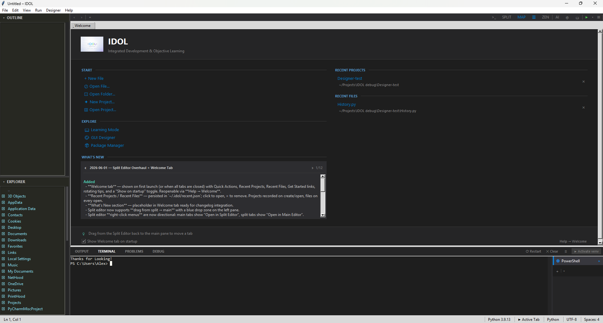
</p>

---

## Quick Start

```
pip install -r requirements.txt
python main.py
```

For LSP (hover, autocomplete, go-to-definition): `pip install python-lsp-server`  
For diagnostics: `pip install ruff`  
For AI features: install [Ollama](https://ollama.com) and run `ollama pull qwen2.5-coder`

→ **[Full setup guide](docs/getting-started.md)**

---

## Features

### GUI Designer

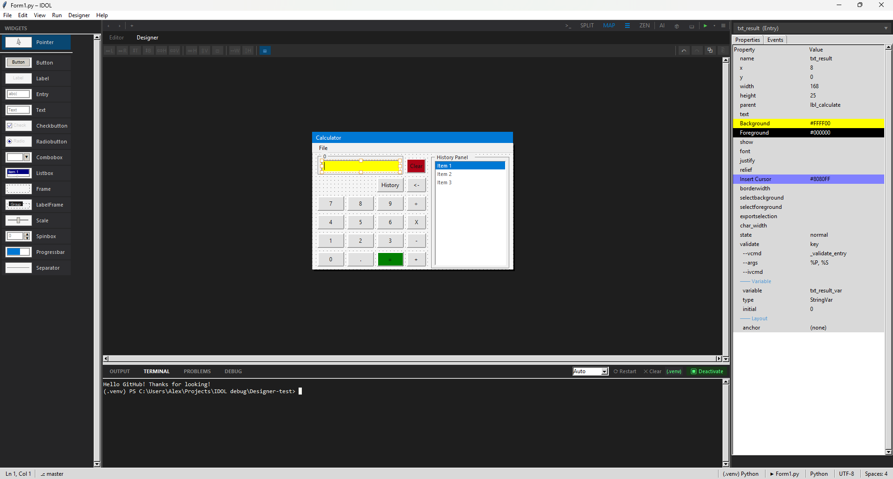
<p align="center">
  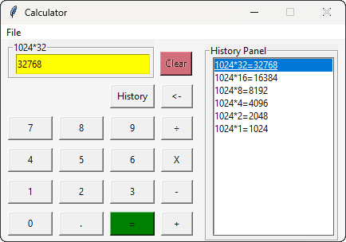
  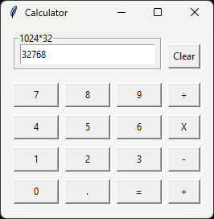
</p>

The only Python IDE with a **VB6-style visual form designer** built in. Drag-and-drop canvas, 14 widget types, live property editing, variable binding, menu builder, and clean class-based code generation — all in a Tkinter project.

→ **[Full designer docs](docs/designer.md)**

### Editor

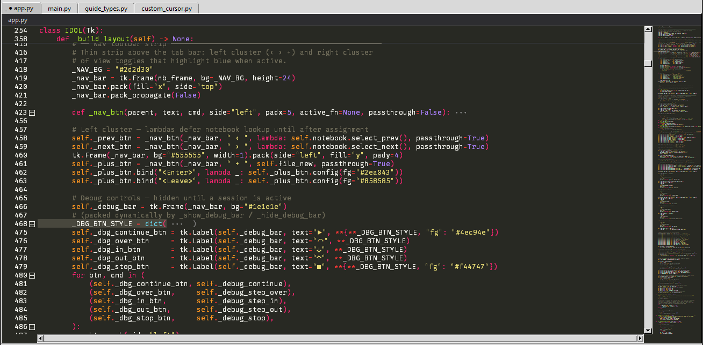

Multi-tab editing with Pygments syntax highlighting, code folding, sticky scroll, minimap, multi-cursor (`Alt+Click`), line move/duplicate, smart pairs, split editor with scroll sync, and VS Code-style find & replace.

→ **[Full editor docs](docs/editor.md)**

### Intelligence (LSP & Diagnostics)

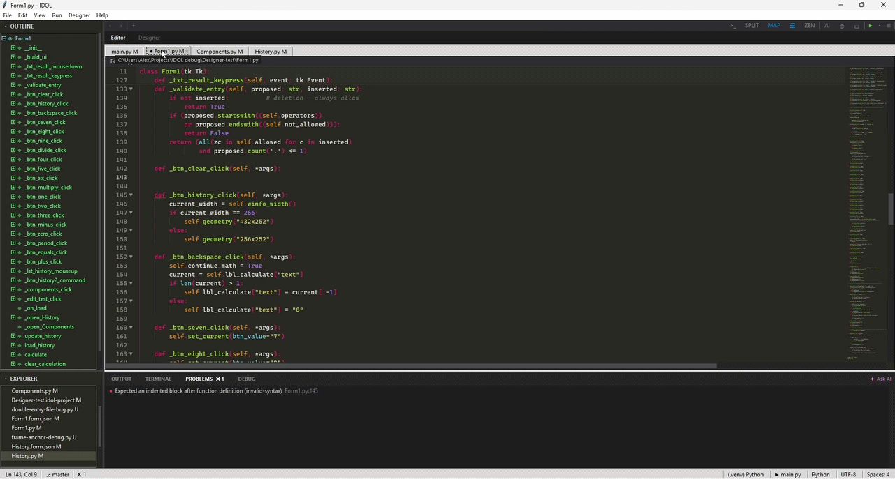

ruff diagnostics on every keystroke (three severity tiers, cascade suppression), Problems panel with hover tooltips and AI double-click, pylsp hover docs, autocomplete, and go-to-definition.

→ **[Full intelligence docs](docs/intelligence.md)**

### Navigation & Search

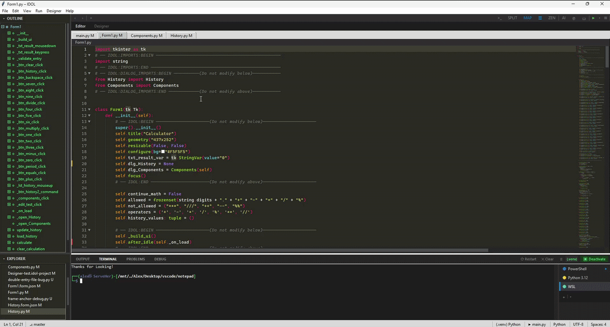

Command palette (`Ctrl+Shift+P`), AST-based Outline panel, File Explorer with inline new-file/rename, Find References, and breadcrumb bar with locals drill-down and sibling picker.

→ **[Full navigation docs](docs/navigation.md)**

### Git Integration

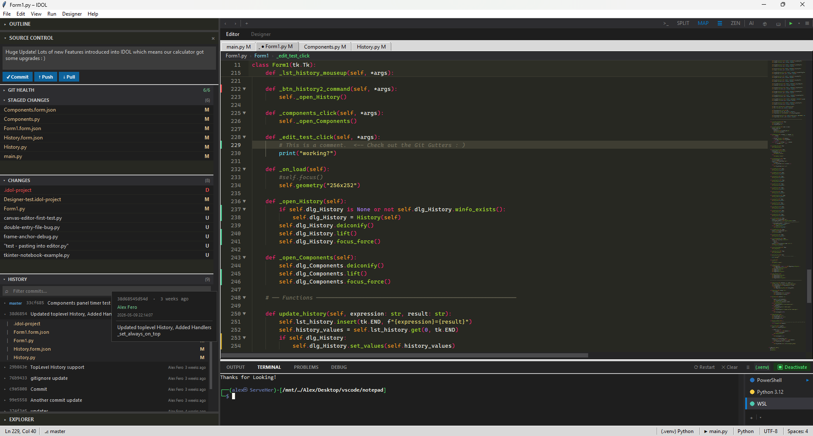

Staging/unstaging, commit, push/pull, gutter diff strips, Git Health panel with one-click fixes, commit history with inline diffs, inline file explanations, and a guided Fix Wizard.

→ **[Full git docs](docs/git.md)**

### Terminal & Output

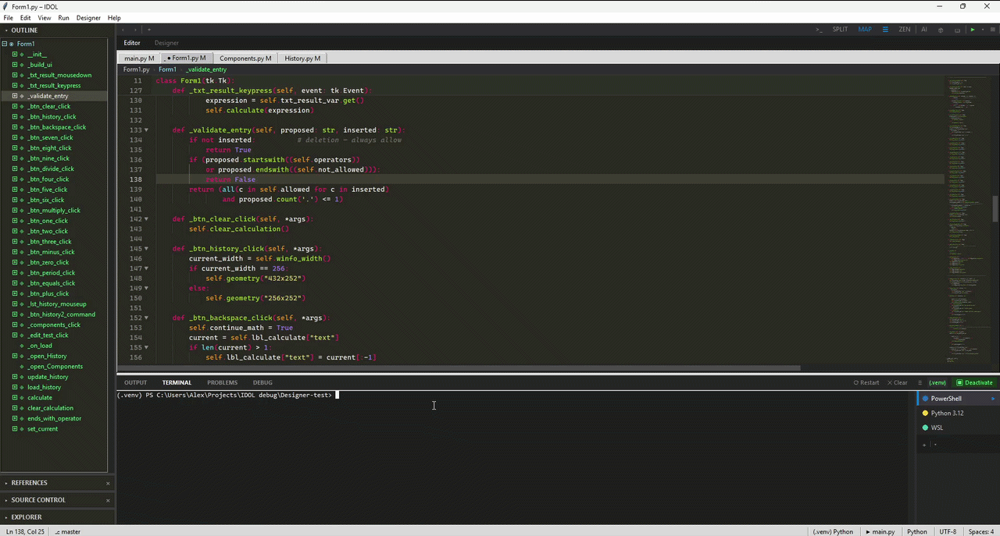

Full VT100 PTY terminal (PowerShell/bash/zsh), venv detection toolbar, Run/Output panel with inline stdin bar, Run Line, Run Selection, and runtime error indicators.

→ **[Full terminal docs](docs/terminal.md)**

### Debugger

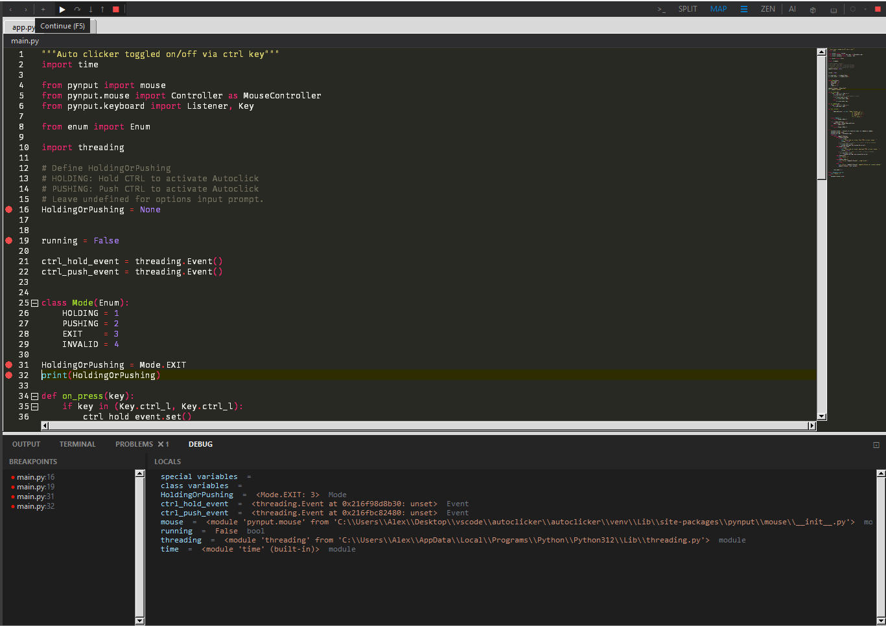

debugpy over DAP — breakpoints with VS Code-style gutter, step controls (F5/F10/F11), LOCALS + BREAKPOINTS panel, floating debug panel, two debug targets (Output or Terminal). No per-project install needed.

→ **[Full debugger docs](docs/debugger.md)**

### AI Chat (F2)

<table><tr>
<td valign="top">

Local Ollama LLM — fully offline, no API key. Send File, Send Selection, streaming responses, syntax-highlighted code blocks, token counter, conversation save/load, and remote host support.

→ **[Full AI chat docs](docs/ai-chat.md)**

</td>
<td width="50%">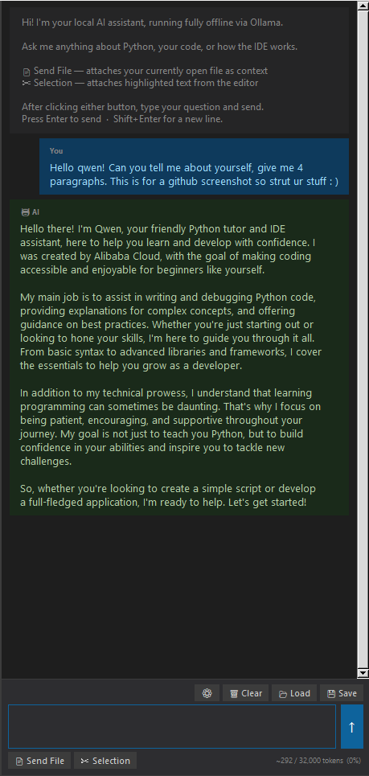</td>
</tr></table>

### Package Manager (F3)

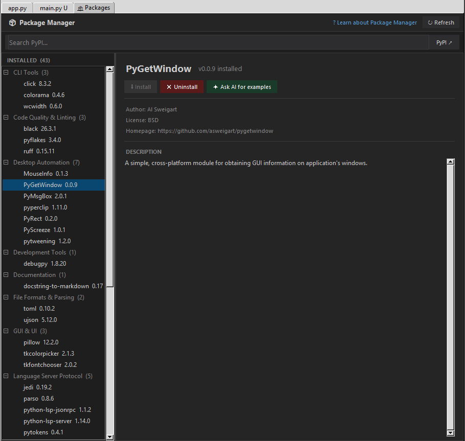

Installed packages grouped by topic, live filter, PyPI search, install/uninstall with live output, and AI examples — all tied to the active interpreter.

→ **[Full package manager docs](docs/package-manager.md)**

### Learning Mode (F1)

<p align="center">
  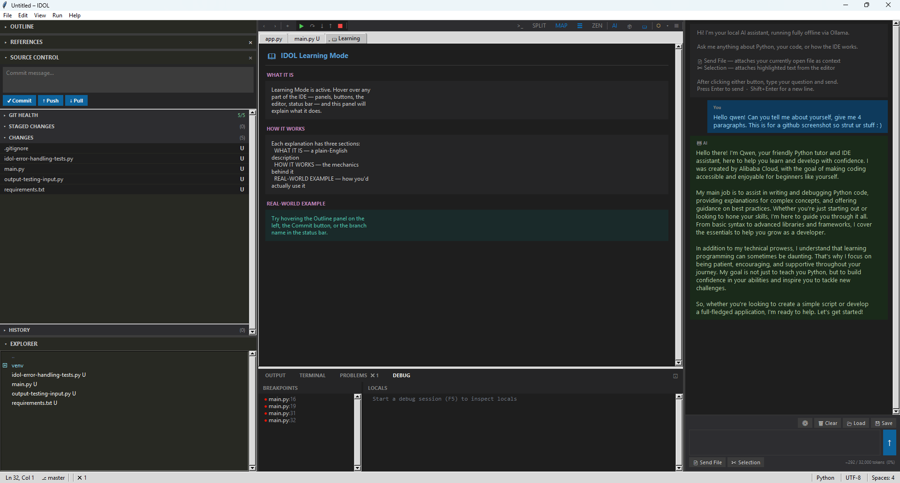
  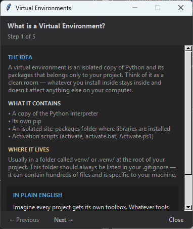
</p>

Hover any IDE element for a three-section explanation (what it is, how it works, real-world example). AI Ask button streams a beginner-friendly explanation via Ollama. Covers 20+ IDE elements.

→ **[Full learning mode docs](docs/learning-mode.md)**

### Project Wizard & Session

<p align="center">
  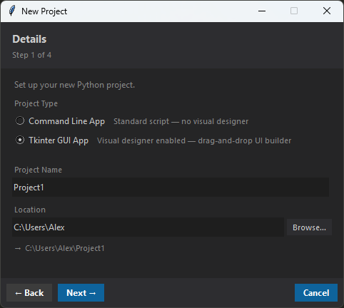
</p>

4-step project setup wizard, per-project interpreter selection, venv management, session persistence, `.idol-project` files, zen mode, and status bar with live git branch and diagnostic count.

→ **[Full project docs](docs/project.md)**

---

## Documentation

| | |
|---|---|
| [Getting Started](docs/getting-started.md) | Install, run, first steps |
| [Keyboard Shortcuts](docs/keyboard-shortcuts.md) | Full shortcut reference |
| [GUI Designer](docs/designer.md) | Canvas, properties, code generation |
| [Editor](docs/editor.md) | Editing, cursor, breadcrumb, split |
| [Intelligence](docs/intelligence.md) | Diagnostics, Problems panel, LSP |
| [Navigation](docs/navigation.md) | Palette, explorer, outline |
| [Git Integration](docs/git.md) | Staging, history, health panel |
| [Terminal & Output](docs/terminal.md) | PTY terminal, output, run |
| [Debugger](docs/debugger.md) | Breakpoints, step, locals |
| [AI Chat](docs/ai-chat.md) | Ollama, send file, token counter |
| [Package Manager](docs/package-manager.md) | Install, uninstall, PyPI search |
| [Learning Mode](docs/learning-mode.md) | Hover explanations, AI |
| [Project & Session](docs/project.md) | Wizard, interpreter, persistence |
| [ROADMAP](ROADMAP.md) | Planned features and backlog |
| [CONTRIBUTING](CONTRIBUTING.md) | Architecture and conventions |
